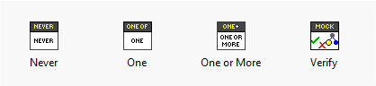
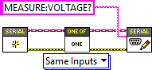
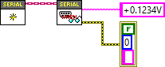

# Introduction to LMock

This document introduces the basic features and components of LMock.
For a more detailed discussion on how to write mock-based tests using LMock, please see [this page](../30_Writing%20Tests%20Using%20Mocks).

## Typical Use Case

LMock is used to generate test doubles to replace concrete classes in unit and integration tests.
A LabVIEW interface must be used to define the VI:s which are to be mocked.
The system under test would typically depend on the abstract Interface and the concrete class would be used in the actual application. 
One typically starts with a first version of the Interface and crete a mock class for the interface.
This class would be used in tests to verify expected behavior and simulate return values during test.
The generated mock can later be updated when the mocked Interface changes.

## The Mock Class

LMock is designed for mocking LabVIEW Interfaces.
A mock may be generated from any Interface using the right click menu in the LabVIEW Project Explorer.
The generated mock class will inherit from the LMock ``Mock.lvclass`` and implement all the Dynamic Dispatch VI:s of the mocked Interface.
It will also provide a When VI for each Dynamic Dispatch VI.
When VI:s are used to declare return values *when* the VI is called.
If the mocked Interface changes, the mock may be updated using the right-click menu in the project explorer.

The ``Mock.lvclass`` implements the necessary boilerplate code for handling expectations, VI calls and return values.
The implementation uses LabVIEW queues, which is a very performant structure with little overhead.
This makes the performance orders of magnitude better than using something like VI server.

## API

The LMock API can be found in the LMock Palette after installing the package.



It consists of three expectation VIs ``Never.vi``, ``One.vi`` and ``One or More.vi`` as well as the ``Verify.vi``.

A typical use case would be to first create a mock using its constructor, then configure expectations on the mock using the expectation API.
Once the expectations are configured the code under test would bwe exercised and the ``Verify.vi`` would finally be called.
This API method verifies that the expectations are met and generates the result description message.
Return values from each VI call may optionally be declared using the When API.

## Expectations

The expectation API is designed for readability.
An expectation is declared using one of the provided API VIs together with a call to the expected Dynamic Dispatch VI.
The Dynamic Dispatch VI is implemented by the mock class and generated through scripting when creating/updating the mock.
An example is given below.



There is always a pair of VI:s for each declared expectation which would read as "expect *one of* vi_name.vi with *same inputs*". 
The following expectations may be used

- Never - Passes only if the declared VI call was never made
- One - Passes only if the declared VI call is made exactly once
- One or More - Passes if the declared VI call is made one or more times
- Exactly - Passes only if the VI call is made exactly a given number of times
- At Least - Passes if the VI Call is made at least a given number of times

All the expectations are polymorphic and offers multiple comparison options used to declare *how* VI calls should be compared when validating a mock.

## Comparisons

Comparisons define *how* two VI calls should be compared and if they should be regarded as matching.
The available comparators are listed below.

- Identical Inputs - Requires all inputs to be equal for the VI calls to match
- Anthing at Inputs - The inputs are ignored and the VI calls will match as long as the same VI is called
- Matching String Inputs - Any string input will be regarded as a regular expression when the mock is configured, and matches if the expression matches the string value when the VI is called.
- Tolerant Numeric Inputs - Any numeric input will need to be within the given tolerance when the VI is called for the VI call to be considered equal.

## Return Values

LMock provides an API for queueing up return values from a VI call through the When API.
Using the generated ``When vi_name.vi`` VI, return values for calls to the ``vi_name.vi`` are enqueued.
Each call to ``vi_name.vi`` will dequeue the next return values, using LabVIEW type-specific defaults if the queue is empty.



The When API is slightly unconventional, as it reverses the direction of data flow to be right-to-left for return values.
Each indicator on the actual VI is replaced with a control on the corresponding When VI, which makes the code read nicely in a unit test.

## Failure descriptions

One important feature of LMock is that it provides fluent failure descriptions when mocks are verified.
The descriptions explains, in plain English, the expected number of VI calls, how the VI:s are compared and lists calls made to the expected VI.
An example would be the following result description of a passing test

```
Write to Log.vi Called Once with String Inputs Matching Expectation
Call 1: Text to Write: "Test" found in "22/07/2023 21:18:50	READ:	Test", error in (no error): No Error(Cluster) == No Error(Cluster)
```