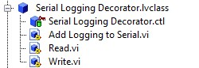
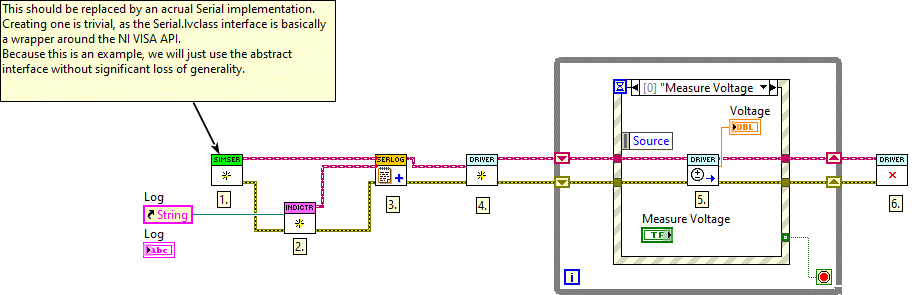
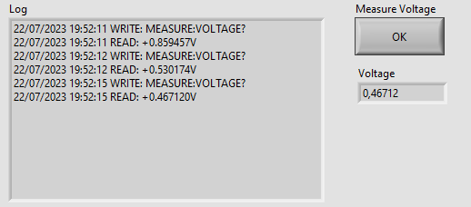

# Writing Tests using Mocks

This document walks through the basic workflow using LMock to test LabVIEW code using mock objects.
All the code introduced in this document is available as example code installed with the toolkit package.
The example code is found at ``C:\Program Files (x86)\National Instruments\LabVIEW 202X\examples\Astemes\LMock``

## Prerequisites

To follow along with the instructions on this page you will need to have LabVIEW version 2020 or later installed as well as the [LUnit unit testing framework](https://github.com/Astemes/astemes-lunit/releases) and the [LMock mocking toolkit](https://github.com/Astemes/astemes-lmock/releases).
The complete code is available as in the LabVIEW examples directory after installation of LMock.

## Using LMock

Below is a brief introduction to basic usage of LMock.
There is a rich syntax provided in the API, for more details, please see the API documentation.
In addition to introducing the API of LMock, we will also consider and highlight some of the benefits of test-first development.

To make this section a bit less abstract, let us continue by looking at a simple example.
The source code is available in the repository and installed as example code.

We will consider a typical Test Driven Development workflow for developing a driver for some instrument.
The details of the instrument are not of interest for now.
We will want to verify what is sent to the instrument by the driver, and how the responses are interpreted.
We would typically start by defining an interface, which wraps the calls to the communication bus.
Note that we do not need to consider what the physical interface actually is (RS-232, TCP/IP, etc.). 
We only care that we can write to and read from the bus and that the data is interpreted as a string.
Initially, our interface could look something like below, as we know we will later want to wrap NI VISA calls in this interface.


As we only need the read and write methods for now, we will not bloat the interface with methods we might need in the future.
We can always extend it later when the need arises and our design has settled.

### Mocking an Interface

LMock does not allow for mocking concrete classes, only abstract interfaces may be mocked.
To generate a Mock for an interface in LabVIEW, simply right-click it in the LabVIEW Project Explorer and select ``Mock...``. 


This will generate a new class which implements the selected interface and inherits from the LMock ``Mock.lvclass``.
All dynamic dispatch VIs are overridden by the mock class, and a special ``When`` VI is generated for each dynamic dispatch VI.
The ``When`` API is used for defining outputs of the mock class when it is called.


The generated mock class can be used as a test double, replacing the concrete implementation of the interface when writing a test.
We now have the tools we need to start writing our first unit test.
To get going, we create an LUnit Test Case and a ``Driver.lvclass`` class for the driver we are about to develop, which is our system under test.
If test-driven development is unfamiliar, please do not get scared by the amount of classes we are creating. 
Our test will tend to push the classes to become loosely coupled and highly cohesive.
It is actually less painful to maintain a large amount of small, cohesive, classes than a small amount of large classes.

### Setting up Expectations

We now have an empty class called ``Driver.lvclass`` and an LUnit Test Case class called ``Driver Test.lvclass``. 
Next, we create a test case VI from the static test template and start filling it out.
The first thing we are going to test is that the driver sends the correct query string to the instrument when we try to read a voltage.

We will now use the LMock syntax to set up expectations on the mock.
This is a central concept for mock-based testing.
The expectation API is designed so that we need to set up what we expect to happen *before* calling the code which causes the events we are testing for.
The test case looks as below.


We first create an instance of ``Serial Mock`` **(1.)**.
Using ``One.vi`` **(2.)** and the ``Write.vi`` **(3.)**, we declare that we expect the ``Write.vi`` method to be called exactly once during the test with the given inputs.
The ``One.vi`` is an LMock API VI used to configure an expectation.
The next VI called on the mock, after ``One.vi``, specifies the call we are expecting together with the desired inputs.

The polymorphic VI selector showing ``Same Inputs`` configures the expectation to match only when all inputs to the ``Write.vi`` are identical to the ones used at **(3.)**.
So in this case, the test will pass if the ``Write.vi`` is called during the test with the string input of ``MEASURE:VOLTAGE?`` and no error at the Error In control.

### Verifying Behavior

Now the Mock has been configured, and we continue by creating an instance of our system under test, the ``Driver.lvclass``, and inject our configured ``Mock Serial`` to the constructor **(4.)**.
Next, we exercise the system under test by calling the ``Read Voltage.vi`` **(5.)**, which is what should trigger the mock to be called.
We clean up **(6.)** and call the ``Verify.vi`` API method with the mock as input, which does the work of verifying the mock and generating the result description message.
The value of a clear failure description should not be underestimated.

As we have been creating the required VIs for our ``Driver.lvclass`` while writing the tests, the block diagrams are still empty, so our test case should fail.
And indeed it does, with the following failure message:

```
Write.vi Expected Once but Never Called with Expected Inputs
```

The implementation for solving this is trivial.
After filling in the blanks, the test passes, and we get the gratifying green bar and the following message:

```
Write.vi Called Once with Expected Inputs
Call 1: error in (no error): No Error(Cluster) == No Error(Cluster), write buffer: MEASURE:VOLTAGE?(String) == MEASURE:VOLTAGE?(String)
```


### Defining Stubbed Behavior 

Now we have verified that our system under test sends the required message for reading a voltage from the instrument.
Next, we need to consider parsing the response from the instrument.
By working one test at a time, we are able to break down the task and focus on one thing at a time.
To continue, we will need to use the ``When Read.vi`` generated by the mocking framework.
The next test case looks as follows.
 


As before, we create a new mock instance **(1.)**, but now we do not configure any expectations for the mock, as we are not going to verify calls made to the mock.
Instead, we use the ``When Read.vi`` **(2.)** to define what is returned by the ``Read.vi`` when it is called. 
As seen in the figure, the LMock When API has inputs where the interface API has outputs, so the direction of the data flow is reversed.
This is intentional, as it results in intuitively readable test code when one gets used to the syntax.

Similar to before, the system under test is initialized **(3.)**, exercised **(4.)**, and cleared **(5.)**. 
As we do not need to verify calls to the mock, we use the regular test verification methods of LUnit **(6.)** to verify that the response is properly parsed.

## Adding a New Feature

The classes developed above are highly cohesive and the ``Driver.lvclass`` is weakly coupled to the serial interface through the ``Serial.lvclass`` interface.
There is a clear separation of concerns, and we have a clear architectural boundary introduced by the abstract interface.
This gives a lot of flexibility as we may **without making any changes to our ``Driver.lvclass``**:

- change the concrete implementation of the ``Serial.lvclass`` interface to use a different bus or calling the bus in a different way
- change how the data is sent to the bus, *e.g.* adding end of line characters
- and more

Let us next explore how we can implement a new, test-driven, feature and how this plugs into our design.

When working with hardware, it is often valuable to be able to probe the data sent on the bus during debugging and integration of the whole system.
The logging feature might then need to be turned off in production to minimize overhead and prevent excessive logs from accumulating.
A well-designed system lets us toggle the logging on or off and allows for redirecting the output to different locations *e.g.* a file or a debug view. 

### Identifying a Design Pattern

In the spirit of test-driven development, we will start by creating a test case.
This test will need to verify that data sent to, and later read from, the instrument is also sent to a log.
This starts to feel like the common decorator pattern, which basically means that we create a wrapper for our interface that "decorates" calls made to the interface by adding logging capabilities.

We could define a decorator class with the following structure to start filling in our fresh test case.



The ``Read.vi`` and ``Write.vi`` are the overrides of the ``Serial.lvclass`` interface (which we are about to decorate).
The ``Add Logging to Serial.vi`` is the VI we are going to use to attach the decorator to any class implementing the ``Serial.lvclass`` interface (including our mock from before).

The implementation of the log is not really important at this point, we just need an interface representing the log to which we can write.
The concrete log may then be implemented as a file, an indicator, an email message, or whatever we may need later in our project.
Let us simply define the an interface for the log with a ``Write to Log.vi`` method as below.


You can probably guess what the abstract write VI looks like; it only has one string control in addition to the default control and indicator pairs.

### Using a Match String Comparator

We can now finish our first test case for the decorator which looks as follows.


This looks very familiar to what we had before, we create a mock **(1.)** and declare an expectation that the string literal "Test" will be matched to the log **(2.)** and **(3.)**.
In this case, we use the polymorphic VI selector to use the ``Match String`` version of the comparator.
This works similarly to the native LabVIEW ``Match Pattern.vi`` for any string input, *i.e.* the test will pass if the string "Test" is matched with what is written to the log.
This is useful, as we might want to add more information to the log *e.g.* a timestamp. 

Note that we use the abstract ``Serial.lvclass`` interface **(4.)** to which we attach the decorator **(5.)**.
This is because we are not really interested in what the Serial interface does, we now only care about what is written to the log.
Using the abstract interface makes the test easier to interpret (and also shaves off some microseconds from the test time).

Finally, we call the ``Write.vi`` on our new decorator, which should trigger the written data to be sent to the log.
As all the block diagrams are empty, this fails with the result:

```
Write to Log.vi Expected Once but Never Called with String Inputs Matching Expectation
```

Again, as is often the case during test-driven development, the implementation is rather trivial.
We can now take this one step further and add the timestamp and "WRITE" string to indicate the action being logged, as alluded to earlier, while still keeping the test passing.
Now the result message reads as:

```
Write to Log.vi Called Once with String Inputs Matching Expectation
Call 1: Text to Write: "Test" found in "21/07/2023 21:17:42 WRITE: Test", error in (no error): No Error(Cluster) == No Error(Cluster)
```

### Forwarding Calls to Decorated Object

The purpose of the decorator design pattern is to add behavior to a class, while not changing what the decorated class does.
Currently, our code fails to do this as the ``Write.vi`` call is never forwarded to the decorated class.
Let's add a test to fix this.


We now create **(1.)** the mock and configure our expectation **(2.)** that it should be called with the string literal "Test" **(3.)**.
We now use the abstract ``Log.lvclass`` interface **(4.)** as input to the ``Add Logging to Serial.vi`` **(5.)** to remove any ambiguity as to what we are testing.
We then call the ``Write.vi`` method **(6.)**, which is the call that must be forwarded to the decorated class.
As expected, this test first fails, and after a very straightforward implementation, the result reads:

```
Write.vi Called Once with Expected Inputs
Call 1: error in (no error): No Error(Cluster) == No Error(Cluster), write buffer: Test(String) == Test(String)
```


### Using Multiple Mocks in One Test

Next, we will need to implement the ``Read.vi`` method of the ``Serial.lvclass`` interface.
This will be very similar to what we have seen before, except now we will need to use both our mocks in the same test.
We will need to use our ``Mock Serial.lvclass`` to fake what is read from the bus and our ``Mock Log.lvclass`` to verify that this data is actually forwarded to the log.
The test will look as below.


This should look familiar at this point.
We create a ``Mock Serial``**(1.)** and configure our expectation **(2.)** that it should return the string literal "Test" when the ``Read.vi`` method is called.
We continue to create a ``Mock Log`` **(3.)** which we configure to expect one call to ``Log.vi`` with the same string literal as before **(4-5)**.
We then attach our logging decorator to the ``Mock Serial`` and direct the output to the ``Mock Log``.
Finally, we call the ``Read.vi`` **(7.)** and verify our expectation **(8.)**.

After implementing the ``Read.vi`` and adding the timestamp and "READ" string, we get the result:

```
Write to Log.vi Called Once with String Inputs Matching Expectation
Call 1: Text to Write: "Test" found in "21/07/2023 21:48:31 READ: Test", error in (no error): No Error(Cluster) == No Error(Cluster)
```


We should now write one more test to verify that the output of the decorated ``Read.vi`` method is returned by the decorator.
Writing this final test is left as an exercise.
(As a footnote, I first skipped this test as I thought it was too trivial, which caused a silly bug and pushed me to add it anyway.
In my experience, it is more common than not that I make a mistake when I cheat and skip writing a test.
But maybe I am just a sub-average developer.)

## Updating a Mock Class

As we work with the code, we might (with very high probability) need to change or update our design.
Let us now explore such a scenario and assume that we now need to make sure that the bus is closed when we are done with it. 
At this point, we need to add a new method to our abstract interface.
After this, our mock class will be broken because it does not implement our new method. 

LMock offers a feature for updating existing Mocks by right-clicking a mock in the LabVIEW project explorer and selecting ``Update Mock...``.


This will replace the existing mock with a new mock re-generated from the mocked interface.
All existing code is relinked to this updated mock class.
We can now continue writing tests using the new API VIs to verify that ``Close.vi`` is called appropriately..

## Putting it All Together

Let us now conclude by looking at how we would use the classes and interfaces developed above in an actual application.
We will need concrete classes implementing the ``Serial.lvclass`` and ``Log.lvclass`` interfaces.

We will now introduce two new classes.
First, we have created a ``Simulated Instrument`` which gives a random reading using the same syntax as the actual instrument when read.
Second, we add a ``String Indicator Logger`` class implementing the ``Log`` interface, which concatenates the data written to the log and writes it to a String Indicator.
The indicator is written through by reference, and the reference is configured in the constructor.

As a minimal demonstration, let us consider the following VI.



We initialize the ``Simulated Instrument`` **(1.)** and a ``String Indicator Logger`` **(2.)**. 
We attach the logger to the simulated instrument using the logging decorator **(3.)**.

Now we wire the decorated serial interface to the constructor of our driver **(4.)**.
Once the ``Driver`` instance has been constructed, it may be used through its API *e.g.* by calling the ``Read Voltage.vi`` **(5.)**.
In addition to returning the voltage from the API call, the calls are written to the front panel indicator using our logging decorator.



## Discussion

The example above shows how driving the design by tests, enabled by mocks, puts a pressure on the design.
One might argue that two concrete classses, an interface, a mock, and a test case is overkill for the simple driver developent shown above.
It is important to keep in mind that a real world application would not be considered done at this point and would grow in complexity considerably before being put into production. 
And then the importance of design increases significantly.

Already when we wanted to add logging to the driver, we were able to leverage the loose coupling between the driver and the actual hardware calls.
Note that when I first started writing this example, I had no intention or plan to add logging, it was added as pure afterthought.
Because of the loose coupling the new feature did not necessitate any changes to the existing driver, which is a charactheristic of good design.

Using test driven development with mocks tends to pull our concrete dependencies to the edges of our modules, as this makes testing simpler.
Injecting dependencies, as shown above, allows for highly flexible architectures.
The dependencies are declared and wired up on the topmost level, the main VI, and the classes are linked through abstract interfaces resulting in a weak coupling between the classses through the interface.
By using factory methods or classes on the top level, we may change how the application is composed in run time and the concrete implementations may be maintained as plugins.